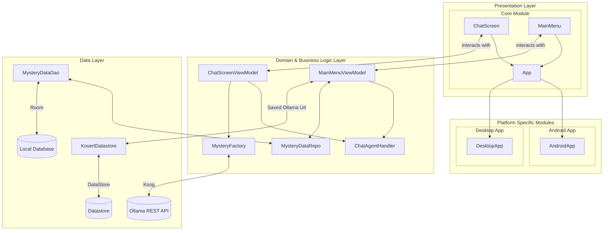

# Kovert

Kovert is an AI-powered social engineering game built with Kotlin Multiplatform. The game challenges you to uncover a secret by interacting with an AI agent
powered by **Ollama**. You'll need to use your wits and social engineering skills to extract the information you need.
available for **Android** and **Desktop(JVM)**

## Demo
https://github.com/user-attachments/assets/3d6aae06-54ee-4753-97b6-12e1b0e62ce0

The AI Agent will try to prevent you from discovering the secret by manipulating the UI through tool calls
it can

- Change the theme of the chat depending on how it feels
- Show a snackBar with it's thought process
- Blur sensitive questions asked by the player

## Architecture

The project follows a modern, clean architecture pattern, with a focus on separation of concerns and a modular design. The core logic is shared between Android and Desktop platforms.



## Built With

Kovert is built with the help of these amazing open-source libraries:

*   [Kotlin Multiplatform](https://www.jetbrains.com/kotlin-multiplatform/): For sharing code between Android and Desktop.
*   [Compose Multiplatform](https://github.com/JetBrains/compose-multiplatform): The declarative UI framework for Kotlin, used for building the Android and Desktop UIs.
*   [Ktor](https://ktor.io/): For making network requests to the Ollama API.
*   [Koin](https://insert-koin.io/): For dependency injection.
*   [Koog](https://github.com/Koog-ApS/koog): For the AI agent functionality.
*   [Room](https://developer.android.com/jetpack/androidx/releases/room): For local data persistence.
*   [Navigation 3](): For navigation between screens.
*   [Material Kolor](https://github.com/jordond/materialkolor): For dynamic color theming.
*   [Hypnotic Canvas](https://github.com/mpe-s/hypnotic-canvas): For the animated background with shaders
*   [Kotlinx Datetime](https://github.com/Kotlin/kotlinx-datetime): For working with dates and times.
*   [Kotlinx Serialization](https://github.com/Kotlin/kotlinx.serialization): For JSON serialization and deserialization.
*   [AndroidX Lifecycle](https://developer.android.com/jetpack/androidx/releases/lifecycle): For `ViewModel` and other lifecycle-aware components.

## How to Run

### 1. Prerequisites

*   **Android Studio:** It is recommended to use the latest nightly version.
*   **Ollama Server:** You'll need an Ollama server running. Follow the [official installation instructions](https://ollama.com/download).

### 2. Ollama Model

Pull the required AI model. This project has been configured with `llama3:3b`.

```bash
ollama pull llama3:3b
```


### 3. Running the App

#### Android

1.  Import the project into Android Studio.
2.  Select the `androidApp` run configuration.
3.  Run it on an emulator or a physical device.

#### Desktop

You can run the desktop app from the command line:

```bash
./gradlew :desktopApp:run
```

### 4. Configuration
When you first launch the app (on either Android or Desktop), you will be prompted to enter the URL of your Ollama server (e.g., `http://localhost:11434`).
